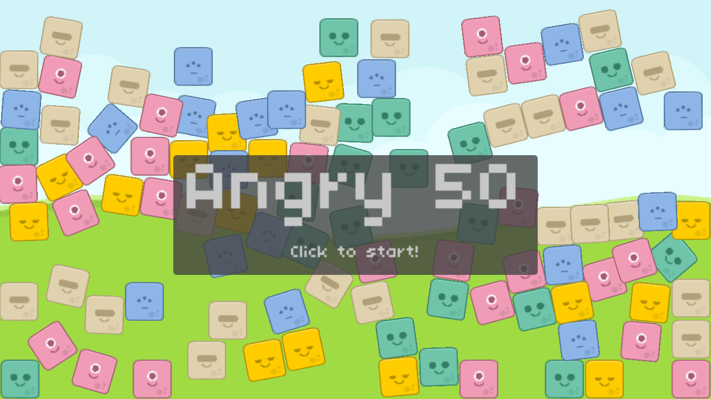

# Angry 50

Assignment 6 from CS50G - Angry Birds clone

Original code [by Colton Ogden](https://cs50.harvard.edu/games/2018/projects/6/angry/)

Assignment:

1. ~~Implement it such that when the player presses the space bar after they’ve launched an Alien, split the Alien into three Aliens that all behave just like the base Alien.~~
2. ~~Only allow splitting before we’ve hit anything~~
3. ~~One new Alien to spawn above and one below the original.~~
4. ~~Lastly, be sure that the launch marker doesn’t reset until all of the Aliens we fling have slowed to nearly being still.~~

# Playing

Keys:

* *space*: Split bird
* *left*, *right* arrows: Scroll background
* *escape*: Quit game

# Screenshots

# Credits

* Almost all of this code was written [by Colton Ogden](https://cs50.harvard.edu/games/2018/projects/6/angry/) for the [CS50G EdX course](https://learning.edx.org/course/course-v1:HarvardX+CS50G+Games/home)
* Additional sound FX generated with [Bfxr](https://www.bfxr.net/)
